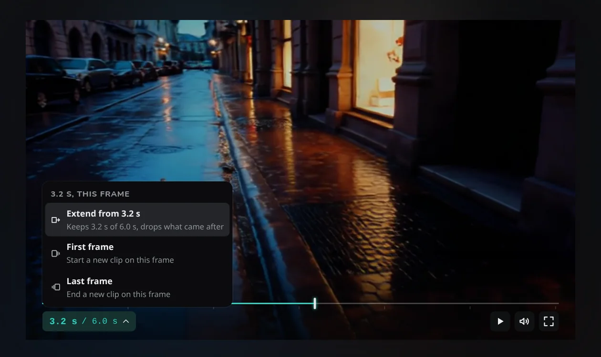
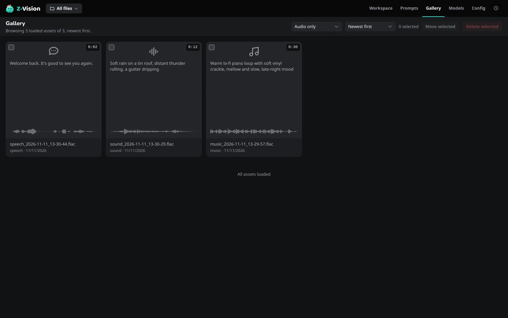

# Gallery and viewer

The **Gallery** (++g++ ++g++) shows every image, video and audio file in your output folder, including ones the command line made there, or just those of the [project](#projects) you have picked. The Workspace's Gallery strip shows the same list, so a new output or a delete shows in both. A click on a tile opens the viewer; [Select mode](#select-move-download-and-delete) acts on many files at once.

## Browse

Filter by kind and sort by date; with **All files** picked, the filter also offers **Not in a project**. The **★** toggle beside the filter shows only [starred](#stars) files and combines with the filter and the project. More files load as you scroll, and coming back to the Gallery restores your place.

Each tile's **⋯** menu has the same actions as the viewer, led by **Reuse settings**, plus **Select**. Right-click a tile with a mouse, or press and hold it on a touch screen, for the same menu. Transparent images show over a checkerboard, which is only a display aid; the file holds real transparency.

**On a phone:** see [Viewer and Gallery on a phone](devices.md#the-viewer-on-a-phone).

### Projects

The Gallery shows the files of the picked [project](../concepts/projects.md). Changing the project clears the selection, closes the viewer and scrolls back to the top; the filter and sort stay.

## Select, move, download and delete { #select-move-download-and-delete }

**Select** in the header, or a tile's checkbox, turns on Select mode. Outside it a click on a tile opens the viewer; inside it a click or tap picks the tile, and Shift-click picks a run. **Done** or ++esc++ ends it. The keys are in [Keyboard shortcuts](shortcuts.md#gallery).

**Select all** picks every file the filter, the **★** toggle and the project match, not only the loaded tiles. **Move**, **Download** and **Delete** act on the picked files, and a file that fails stays picked so you can try again. **Download** saves one uncompressed zip with the folders kept.

### Move to project { #move-to-project }

**Move to project…** is in the **⋯** menu of a Gallery tile, a Workspace strip tile, the preview and the viewer, and in the viewer's toolbar as **Move**. The rules are in [Move a file to another project](../concepts/projects.md#move-a-file-to-another-project).

## Stars { #stars }

A star marks a file you want to find again. Star it from the star in its tile's caption, **⋯** → **Star** or the viewer's **Star** button (++s++); the **★** toggle beside the filter shows starred files only, and unstarring there takes the file out of the list. On a tablet or phone a tile shows its star only while starred, so star from **⋯** or the viewer. Stars also work in the Workspace strip and viewer.

Stars are kept by the Web UI, so every device sees the same ones. They follow a file when you [move it to another project](#move-to-project) and survive moving or renaming the output folder. A file you rename, move or delete outside the app loses its star, and a new file that takes its name shows it.

## The viewer

Clicking a tile grows it into the viewer. On a computer or iPad the viewer is a panel over the page with the details beside the image; on a phone it fills the screen, see [The viewer on a phone](devices.md#the-viewer-on-a-phone). Step through the set with the arrow keys. Zoom into an image to see its real pixels: click it on a computer, or pinch or double-tap on a touch screen.

The toolbar offers **Reuse settings**, **Use as**, **Extend** (videos), **Edit** (images), **Upscale**, **Move**, **Star**, **Download**, **Delete** and **Details**, described below. **Delete** asks first. The keys are in [Keyboard shortcuts](shortcuts.md#viewer).

**Edit** (++m++) opens an image in **Image** on its **Edit** kind, with an empty prompt and no paint. What to do next is in [Edit a picture](../guides/images.md#edit), and the screen is described in [Edit an image](workspace.md#edit-an-image).

### The player

Video and audio play in the viewer, in the Workspace preview and in the file browser's preview. A video opens on its first frame and never plays by itself. Click or drag the timeline to seek; while dragging, move up to slow the scrub to one frame at a time. The player's keys are in [Keyboard shortcuts](shortcuts.md#player).

### Use a paused frame

Pause a video partway through to pick a frame. The time at the left of the controls becomes a menu button, such as **3.2 s / 5.0 s ⌃**, in the viewer and in the Workspace preview (where the **⋯** menu offers the same choices).

**Extend from 3.2 s** opens **Video** on its Extend kind with the clip as the source and the point at that frame. **First frame** and **Last frame** put the frame into **Video** as that image.

- A video at its start or playing is not a selection: **Extend** continues from the end of the clip.
- A video stopped at its end offers its last frame.
- A frame less than 25 frames in can't be extended from.
- A frame a model can't use is greyed with the reason.

What each one does is in [Use a frame of a video](../guides/video.md#a-frame-of-a-video) and [Extend from a point](../guides/video.md#from-a-point).

## Details

**Details** shows how the file was made, starting with its **Project**. The fields are in [Output files](../reference/data-folder.md#output-files). **Enhanced with** shows how an enhanced prompt was made, with **Your prompt** under it, and **Made from** names the image an edit or an upscale was made from. **Reuse notice** lists what **Reuse settings** would have to change, such as an original model that isn't set up here (the default model is used instead).

### Audio takes { #audio }

A tile doesn't play; open it, and the viewer shows a [player](#the-player) whose waveform is the timeline.

An audio file without this app's settings, such as one you copied into the output folder, plays but has no **Reuse settings**. What a take is and where it is saved is in [Find your takes](../guides/music.md#takes-and-files).

## Reuse settings

**Reuse settings** loads the file's settings into the Workspace tab that made it: model, LoRAs, quant, size, seed, references and the rest. A setting the file did not record takes its default, and the open tab's settings, images, prompts, LoRAs, quant and enhance options are replaced; the other tabs and kinds stay as they are. How to use it for variations is in [Make variations with Reuse](../guides/better-results.md#make-variations-with-reuse-and-a-new-seed).

- Post-processing, the upscale settings and **Strength** come back too. For an image upscaled in the viewer, only **Transparent** does.
- For an enhanced prompt, **Prompt** gets what you typed, **Enhanced** gets the rewrite, and the enhance options come back too.
- For a video, Scene and Action are filled. A video that was itself an extension comes back with its source.
- An edit comes back on the **Edit** kind with the same image, prompt and settings. The paint isn't saved, so the Workspace says *Paint the area again*.
- For audio, it opens the **Audio** tab on the take's kind with the settings it was made with. A setting the take did not set, such as a song made without a Tempo, comes back on **Auto**.

## Use as

**Use as** changes only what it names. For an image it opens the **Images** section of the Workspace in the slot you choose; how each slot is used is in [Start from an image](../guides/images.md#start-from-an-image), [references](../guides/images.md#references) and [First and last frame](../guides/video.md#first-and-last-frame).

- **Start image** puts the prompt in the Prompt box. The text of **Video** stays as it was.
- **Reference** adds the image as the next reference; the prompt and everything else stay as they are.
- **First frame** puts the prompt in Scene, since it describes the first frame, leaving Action empty.
- **Last frame** needs a first frame too before **Generate** works.

A target the model it opens on can't use is greyed, with the reason beside it. The arrow keys still stop on a greyed item so you can read why.

### Use as an audio track or a voice { #use-as-an-audio-track-or-a-voice }

On an audio take, **Use as** offers **Audio track**, which opens **Video** with the file as the clip's audio track (see [Follow an audio track](../guides/video.md#audio-track)), and, for speech takes, **Voice**, a one-off recording in **Audio** on Speech, and **Saved voice**, which saves the take in **Your voices**. A take that followed a recording or a saved voice also asks for the consent tick. Both voice items are greyed for a take longer than 30 seconds. See [Use a take as a voice](../guides/speech-and-sound.md#use-a-take-as-a-voice).

## Upscale menu

**Upscale** is in the viewer's toolbar and in a tile's **⋯** menu. Each item starts a job that runs in the Workspace or joins its queue. What the options do, when one is missing and what they cost in memory is in [Upscaling](../concepts/upscaling.md).

### An image { #upscale-an-image }

The menu offers **2×** and **4×**, and **2× creative** and **4× creative** where the image's model can refine. What each does and where the result is saved is in [Upscaling a finished image](../concepts/upscaling.md#upscaling-an-existing-image).

### A video { #upscale-a-video }

The menu offers one item, which makes a 2× copy. Which clips have it, what the markers beside a size mean and how it differs between macOS and Windows or Linux is in [Upscaling a finished video](../concepts/upscaling.md#upscaling-an-existing-video).
